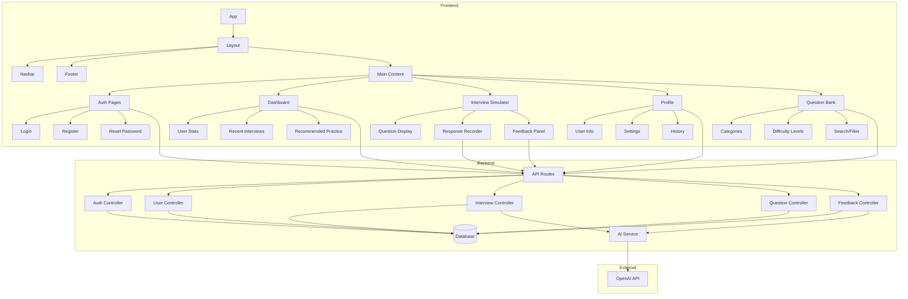
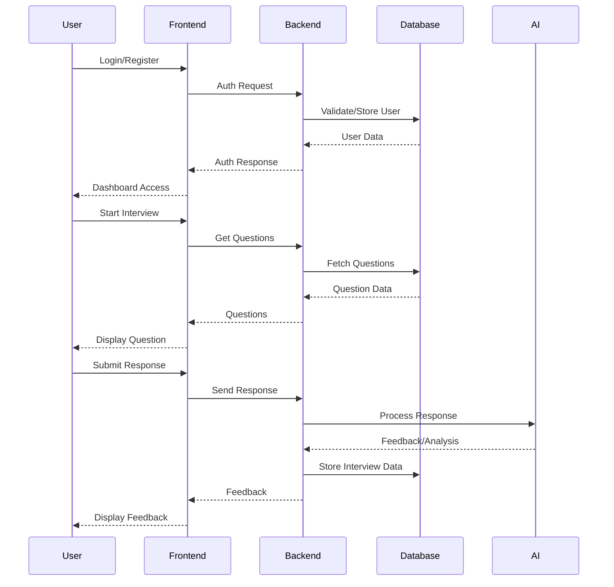
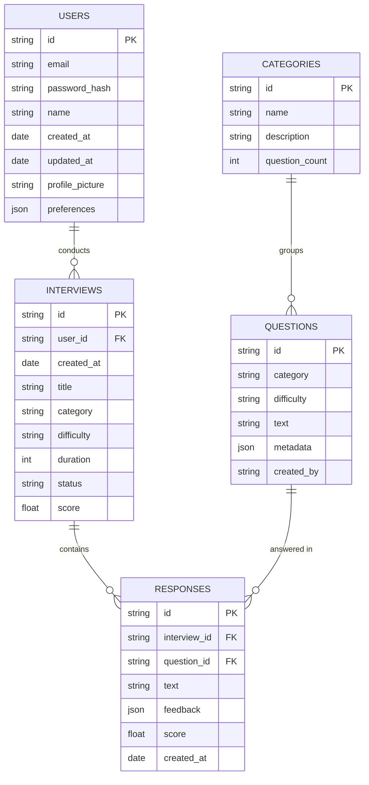
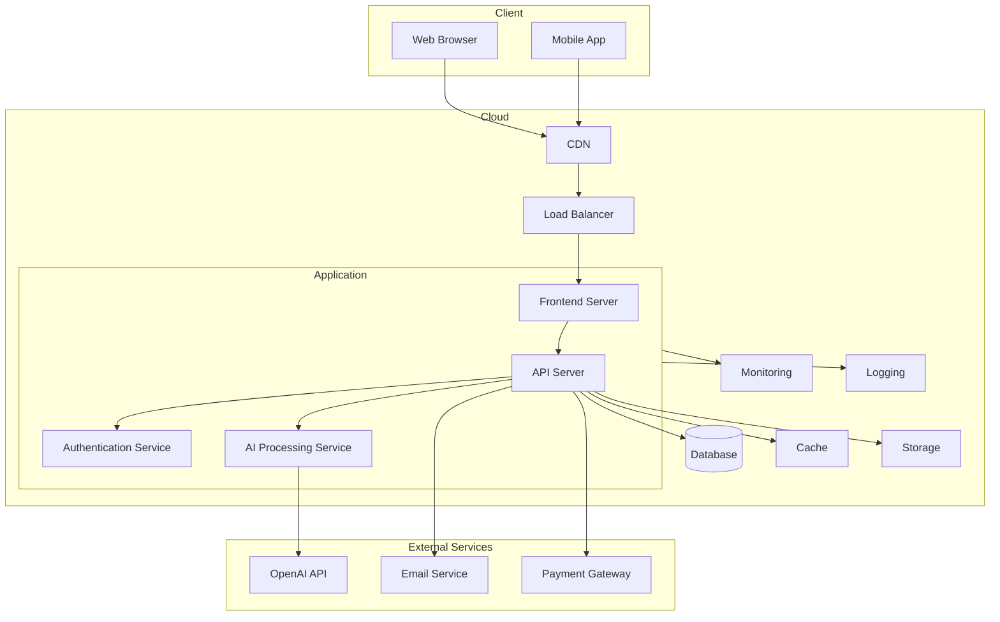

# AIInterviewMaster Project Structure

Below is a visual representation of the AIInterviewMaster project architecture using Mermaid diagrams.

## Component Architecture



## Data Flow



## Database Schema



## Deployment Architecture



## Video Player Component

A. VideoPlayer.tsx
   - Purpose: Playback of recorded videos
   - Features:
     - Takes video URL as input
     - Handles loading states
     - Shows errors
     - Basic video controls

## Video Grid Component

B. VideoGrid.tsx
   - Purpose: Live video streaming interface
   - Features:
     - Shows AI interviewer and candidate videos
     - Camera controls (on/off) ----------------------->
     - Microphone controls
     - Background settings
     - Status indicators ------------------------------>

## useWebRTC Hook

C. useWebRTC Hook
   - Purpose: Core video stream management
   - Features:
     - Stream initialization
     - Track management
     - Camera/mic toggling
     - Recording functionality
     - Stream health monitoring

```
## Video Implementation Flow

mermaid
graph TB
    subgraph InterviewSession
        IS[Interview Session Page] --> VG[VideoGrid Component]
        IS --> VP[VideoPlayer Component]
    end

    subgraph VideoGrid_Flow
        VG --> useWebRTC
        useWebRTC --> |Initialize| SM[Stream Management]
        SM --> |Monitor| SH[Stream Health]
        SM --> |Control| TC[Track Controls]
        
        TC --> |Toggle| CAM[Camera]
        TC --> |Toggle| MIC[Microphone]
        
        CAM --> |On| CO[Camera On Flow]
        CAM --> |Off| CF[Camera Off Flow]
        
        CO --> |1| REQ[Request Permission]
        CO --> |2| INIT[Initialize Stream]
        CO --> |3| ATTACH[Attach to Video Element]
        
        CF --> |1| STOP[Stop Tracks]
        CF --> |2| CLEAR[Clear Video Element]
        CF --> |3| CLEANUP[Clean References]
    end

    subgraph Recording_Flow
        REC[Recording Controls] --> |Start| SR[Start Recording]
        REC --> |Stop| STR[Stop Recording]
        
        SR --> |1| CLONE[Clone Stream]
        SR --> |2| CREATE[Create MediaRecorder]
        SR --> |3| CHUNKS[Collect Data Chunks]
        
        STR --> |1| STOP_REC[Stop MediaRecorder]
        STR --> |2| BLOB[Create Blob]
        STR --> |3| UPLOAD[Upload Recording]
    end

    subgraph VideoPlayer_Flow
        VP --> |1| LOAD[Load Video]
        VP --> |2| META[Load Metadata]
        VP --> |3| PLAY[Enable Playback]
        
        LOAD --> |Error| ERR[Show Error]
        LOAD --> |Success| SUCCESS[Show Controls]
    end
```

## Video Implementation Flow Details

1. **Initial Setup**
```typescript
// InterviewSession mounts
↓
// VideoGrid initializes
↓
// useWebRTC hook sets up:
- Stream states
- Track references
- Event listeners
- Health monitoring
```

2. **Camera Initialization Flow**
```typescript
User clicks "Initialize Camera"
↓
startLocalStream()
↓
navigator.mediaDevices.getUserMedia()
↓
Set up track event listeners
↓
Attach stream to video element
```

3. **Camera Toggle Flow**
```typescript
User clicks camera toggle
↓
toggleCamera()
↓
If turning OFF:
  - Stop all video tracks
  - Remove tracks from stream
  - Clear video element
  - Clean up references
  - Stop health monitoring
↓
If turning ON:
  - Request new video stream
  - Add track to existing stream
  - Attach to video element
  - Resume health monitoring
```

4. **Recording Flow**
```typescript
Start Recording
↓
Clone stream for protection
↓
Create MediaRecorder
↓
Collect data chunks
↓
Stop Recording
↓
Create Blob
↓
Upload to server
```

5. **Video Playback Flow**
```typescript
VideoPlayer receives URL
↓
Load video metadata
↓
Show loading state
↓
Enable controls when ready
↓
Handle errors if they occur
```

6. **Health Monitoring Flow**
```typescript
Every 3 seconds:
↓
Check if camera is meant to be on
↓
Verify track states
↓
If issues detected AND camera should be on:
  - Attempt recovery
  - Reconnect stream
  - Restart tracks if needed
```

This implementation ensures:
- Clear separation of concerns between components
- Proper resource management
- Graceful error handling
- Smooth user experience
- Proper cleanup of device resources

The key to fixing the camera persistence issue is ensuring that the health monitoring system respects the camera's intended state and that all track instances are properly stopped when turning the camera off.
