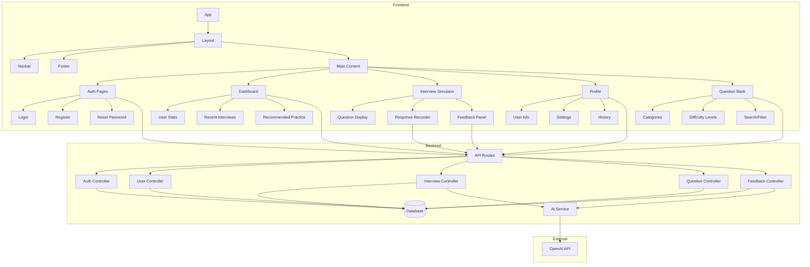
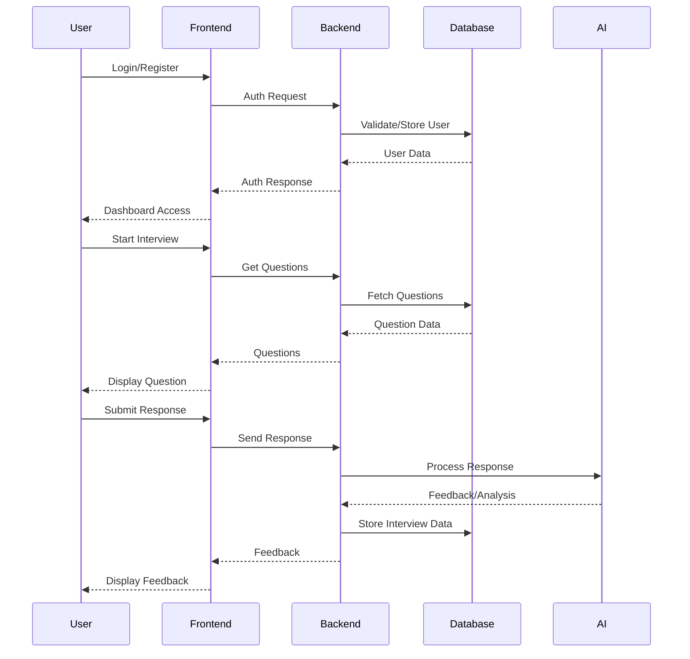
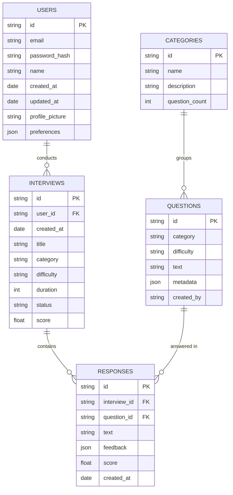
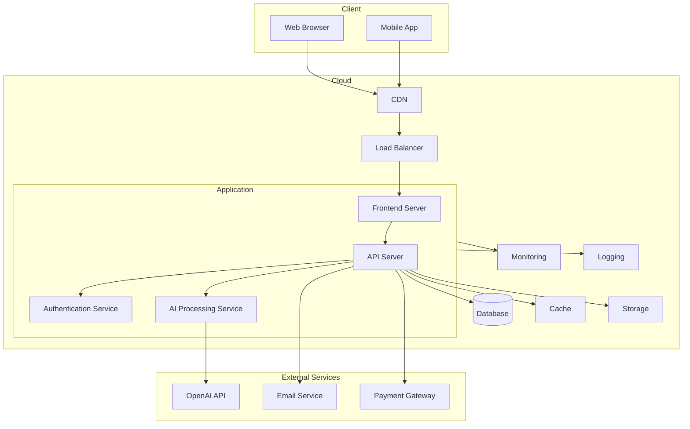

# AIInterviewMaster Project Structure

Below is a visual representation of the AIInterviewMaster project architecture using Mermaid diagrams.

## Component Architecture

## Data Flow

## Database Schema

## Deployment Architecture

